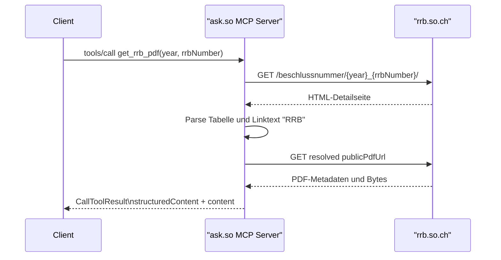
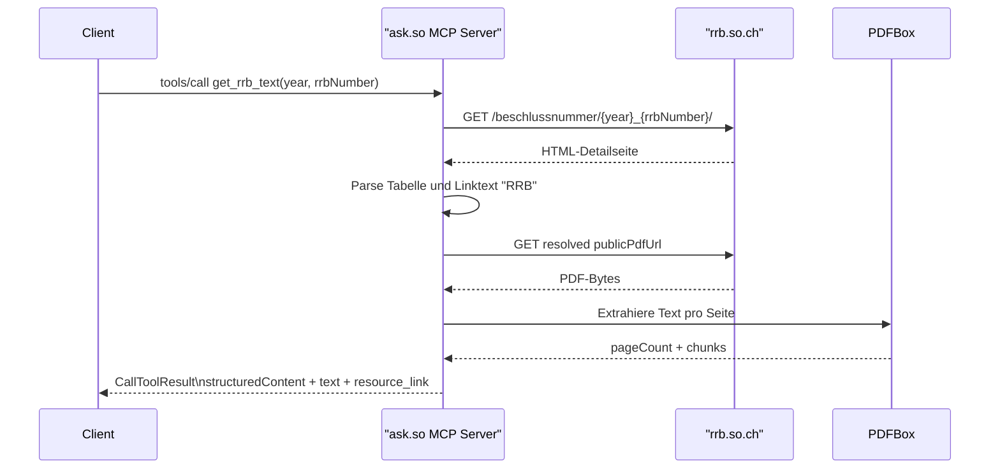
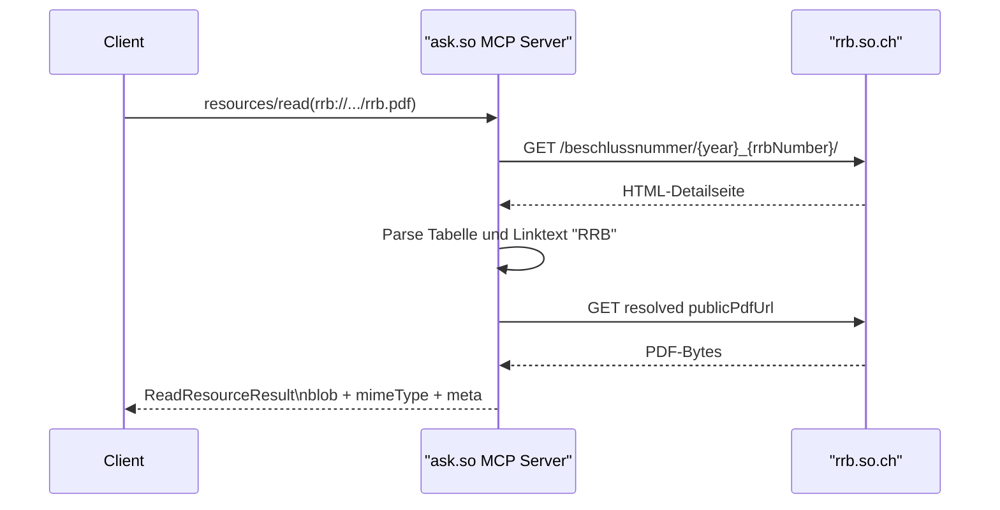

# MCP Tools in `ask.so`

Diese Datei dokumentiert den aktuellen MCP-Server von `ask.so` mit Fokus auf:

- verfuegbare Tools
- JSON-RPC Request- und Response-Struktur
- Bedeutung von `structuredContent` und `content`
- Fehlerfaelle
- PDF-Resource

Die Beispiele zeigen die aktuelle Wire-Struktur des Servers. Feldnamen, Array-Reihenfolge und Schluessel sind absichtlich nah an der echten Antwort gehalten. Einzelne URL-Werte sind teilweise mit klaren Platzhaltern dargestellt, wenn der echte PDF-Pfad dynamisch aus HTML aufgeloest wird.

## Ueberblick

- Transport: Streamable HTTP
- MCP-Endpunkt: `/mcp`
- Aktuelle Tools:
  - `get_rrb_pdf`
  - `get_rrb_text`
- Aktuelle Resource:
  - `rrb://so.ch/regierungsratsbeschluss/{year}/{rrbNumber}/rrb.pdf`

Typischer Einsatzzweck:

- `get_rrb_pdf`: Original-PDF, PDF-Link, PDF-Resource
- `get_rrb_text`: Text fuer Zusammenfassung, Analyse und Fragebeantwortung

## MCP-Grundmuster

Ein typischer HTTP-Ablauf besteht aus diesen Schritten:

1. `initialize`
2. `notifications/initialized`
3. `tools/list`
4. `tools/call`
5. optional `resources/templates/list`
6. optional `resources/read`

### Beispiel: `initialize`

Request:

```json
{
  "jsonrpc": "2.0",
  "id": 1,
  "method": "initialize",
  "params": {
    "protocolVersion": "2025-06-18",
    "capabilities": {},
    "clientInfo": {
      "name": "example-client",
      "version": "1.0"
    }
  }
}
```

Response:

```json
{
  "jsonrpc": "2.0",
  "id": 1,
  "result": {
    "protocolVersion": "2025-06-18",
    "capabilities": {
      "tools": {
        "listChanged": false
      },
      "resources": {
        "subscribe": false,
        "listChanged": false
      }
    },
    "serverInfo": {
      "name": "ask.so",
      "version": "0.1.0-SNAPSHOT"
    }
  }
}
```

### Beispiel: `tools/list`

Die Antwort enthaelt die Tool-Metadaten inklusive Input- und Output-Schema.

```json
{
  "jsonrpc": "2.0",
  "id": 2,
  "result": {
    "tools": [
      {
        "name": "get_rrb_pdf",
        "title": "RRB (Regierungsratsbeschluss) PDF",
        "description": "Loest den Solothurner Hauptbeschluss anhand von Jahr und RRB-Nummer auf und liefert das Original-PDF fuer Download und Referenz.",
        "inputSchema": {
          "type": "object",
          "additionalProperties": false,
          "properties": {
            "year": {
              "type": "integer",
              "description": "Vierstelliges Jahr des Regierungsratsbeschlusses."
            },
            "rrbNumber": {
              "type": "integer",
              "description": "RRB-Nummer innerhalb des angegebenen Jahres."
            }
          },
          "required": [
            "year",
            "rrbNumber"
          ]
        },
        "outputSchema": {
          "type": "object",
          "additionalProperties": false,
          "properties": {
            "year": {
              "type": "integer"
            },
            "rrbNumber": {
              "type": "integer"
            },
            "sourcePageUrl": {
              "type": "string"
            },
            "publicPdfUrl": {
              "type": "string"
            },
            "pdfResourceUri": {
              "type": "string"
            },
            "pdfMimeType": {
              "type": "string"
            },
            "errorCode": {
              "type": "string"
            },
            "message": {
              "type": "string"
            }
          },
          "required": [
            "year",
            "rrbNumber"
          ]
        },
        "annotations": {
          "title": "RRB (Regierungsratsbeschluss) PDF",
          "readOnlyHint": true,
          "destructiveHint": false,
          "idempotentHint": true,
          "openWorldHint": true
        }
      },
      {
        "name": "get_rrb_text",
        "title": "RRB (Regierungsratsbeschluss) Text",
        "description": "Extrahiert den Text des Solothurner Hauptbeschlusses seitenweise aus dem Original-PDF und liefert zusaetzlich den verifizierten Link auf das Originaldokument.",
        "inputSchema": {
          "type": "object",
          "additionalProperties": false,
          "properties": {
            "year": {
              "type": "integer",
              "description": "Vierstelliges Jahr des Regierungsratsbeschlusses."
            },
            "rrbNumber": {
              "type": "integer",
              "description": "RRB-Nummer innerhalb des angegebenen Jahres."
            }
          },
          "required": [
            "year",
            "rrbNumber"
          ]
        },
        "outputSchema": {
          "type": "object",
          "additionalProperties": false,
          "properties": {
            "year": {
              "type": "integer"
            },
            "rrbNumber": {
              "type": "integer"
            },
            "sourcePageUrl": {
              "type": "string"
            },
            "publicPdfUrl": {
              "type": "string"
            },
            "filename": {
              "type": "string"
            },
            "pageCount": {
              "type": "integer"
            },
            "chunks": {
              "type": "array",
              "items": {
                "type": "object",
                "additionalProperties": false,
                "properties": {
                  "pageNumber": {
                    "type": "integer"
                  },
                  "text": {
                    "type": "string"
                  }
                },
                "required": [
                  "pageNumber",
                  "text"
                ]
              }
            },
            "errorCode": {
              "type": "string"
            },
            "message": {
              "type": "string"
            }
          },
          "required": [
            "year",
            "rrbNumber"
          ]
        },
        "annotations": {
          "title": "RRB (Regierungsratsbeschluss) Text",
          "readOnlyHint": true,
          "destructiveHint": false,
          "idempotentHint": true,
          "openWorldHint": true
        }
      }
    ]
  }
}
```

## Aufbau einer MCP-Tool-Antwort

Die Tool-Antworten dieses Servers verwenden diese Schichten:

- JSON-RPC-Huelle:
  - `jsonrpc`
  - `id`
  - `result`
- `result.structuredContent`:
  - maschinenlesbare Felder
  - stabile Schluessel fuer Clients und Folge-Logik
- `result.content`:
  - LLM- und clientfreundliche Inhalte
  - sichtbare `text`-Eintraege
  - sichtbare `resource_link`-Eintraege
- `result.isError`:
  - `false` bei Erfolg
  - `true` bei Tool-Fehlern
- JSON-RPC `error`:
  - wird vor allem bei `resources/read` verwendet, wenn die Resource nicht aufgeloest werden kann

### Bedeutung der `content`-Typen

- `text`
  - direkt sichtbarer Text fuer Modell und Client
  - wichtig fuer Clients, die `structuredContent` nicht voll auswerten
- `resource_link`
  - verweisender Inhalt mit `uri`, `title`, `mimeType` etc.
  - kein eingebetteter Blob

## Tool: `get_rrb_pdf`

### Zweck

`get_rrb_pdf` loest den Hauptbeschluss eines Solothurner RRB auf und liefert:

- die Detailseite
- den verifizierten oeffentlichen PDF-Link
- die interne MCP-PDF-Resource

Dieses Tool ist die richtige Wahl fuer:

- PDF-Link anzeigen
- Originaldokument referenzieren
- PDF-Resource spaeter ueber `resources/read` laden

### Parameter

```json
{
  "year": 2026,
  "rrbNumber": 292
}
```

- `year`: Integer, Pflichtfeld
- `rrbNumber`: Integer, Pflichtfeld

### Beispiel: `tools/call` Request

```json
{
  "jsonrpc": "2.0",
  "id": 3,
  "method": "tools/call",
  "params": {
    "name": "get_rrb_pdf",
    "arguments": {
      "year": 2026,
      "rrbNumber": 292
    }
  }
}
```

### Beispiel: Erfolgsantwort

```json
{
  "jsonrpc": "2.0",
  "id": 3,
  "result": {
    "structuredContent": {
      "year": 2026,
      "rrbNumber": 292,
      "sourcePageUrl": "https://rrb.so.ch/beschlussnummer/2026_292/",
      "publicPdfUrl": "https://rrb.so.ch/<resolved-main-document-url>",
      "pdfResourceUri": "rrb://so.ch/regierungsratsbeschluss/2026/292/rrb.pdf",
      "pdfMimeType": "application/pdf"
    },
    "content": [
      {
        "type": "text",
        "text": "RRB 2026/292 wurde gefunden; verwende jetzt die PDF-Resource."
      },
      {
        "type": "resource_link",
        "name": "RRB__2026-292.pdf",
        "title": "RRB 2026/292 (oeffentlicher PDF-Link)",
        "uri": "https://rrb.so.ch/<resolved-main-document-url>",
        "description": "Direkter oeffentlicher Link zum Original-PDF des Regierungsratsbeschlusses.",
        "mimeType": "application/pdf",
        "size": 53248
      },
      {
        "type": "resource_link",
        "name": "rrb_pdf",
        "title": "RRB 2026/292 PDF-Resource",
        "uri": "rrb://so.ch/regierungsratsbeschluss/2026/292/rrb.pdf",
        "description": "Autoritative MCP-PDF-Resource fuer die inhaltliche Weiterverarbeitung.",
        "mimeType": "application/pdf",
        "size": 53248
      }
    ],
    "isError": false
  }
}
```

### Struktur im Detail

`structuredContent`:

- `year`
  - das aufgeloeste Jahr
- `rrbNumber`
  - die aufgeloeste Beschlussnummer
- `sourcePageUrl`
  - die HTML-Detailseite auf `rrb.so.ch`
- `publicPdfUrl`
  - der echte, aus der HTML-Tabelle aufgeloeste Download-Link fuer den Hauptbeschluss
- `pdfResourceUri`
  - die MCP-URI fuer spaeteres `resources/read`
- `pdfMimeType`
  - derzeit `application/pdf`

`content`:

- `content[0]`
  - menschenlesbare Zusammenfassung
- `content[1]`
  - `resource_link` auf den oeffentlichen PDF-Link
- `content[2]`
  - `resource_link` auf die interne MCP-PDF-Resource

### Beispiel: Fehlerantwort

```json
{
  "jsonrpc": "2.0",
  "id": 7,
  "result": {
    "structuredContent": {
      "year": 2026,
      "rrbNumber": 999,
      "errorCode": "NOT_FOUND",
      "message": "RRB-Seite wurde nicht gefunden.",
      "sourcePageUrl": "https://rrb.so.ch/beschlussnummer/2026_999/"
    },
    "content": [
      {
        "type": "text",
        "text": "RRB konnte nicht aufgeloest werden: RRB-Seite wurde nicht gefunden."
      }
    ],
    "isError": true
  }
}
```

Typische Fehlercodes:

- `INVALID_INPUT`
- `NOT_FOUND`
- `DOCUMENTS_ROW_MISSING`
- `RRB_LINK_MISSING`
- `PDF_FETCH_FAILED`
- `UPSTREAM_UNAVAILABLE`

### Sequence Diagram: `get_rrb_pdf`



## Tool: `get_rrb_text`

### Zweck

`get_rrb_text` extrahiert den Text des Hauptdokuments seitenweise aus dem PDF und liefert zusaetzlich den verifizierten PDF-Link sichtbar im Tool-Output.

Dieses Tool ist die richtige Wahl fuer:

- Zusammenfassungen
- inhaltliche Analyse
- direkte Fragen zum Beschlussinhalt

### Parameter

```json
{
  "year": 2026,
  "rrbNumber": 292
}
```

### Beispiel: `tools/call` Request

```json
{
  "jsonrpc": "2.0",
  "id": 33,
  "method": "tools/call",
  "params": {
    "name": "get_rrb_text",
    "arguments": {
      "year": 2026,
      "rrbNumber": 292
    }
  }
}
```

### Beispiel: Erfolgsantwort

```json
{
  "jsonrpc": "2.0",
  "id": 33,
  "result": {
    "structuredContent": {
      "year": 2026,
      "rrbNumber": 292,
      "sourcePageUrl": "https://rrb.so.ch/beschlussnummer/2026_292/",
      "publicPdfUrl": "https://rrb.so.ch/<resolved-main-document-url>",
      "filename": "RRB__2026-292.pdf",
      "pageCount": 2,
      "chunks": [
        {
          "pageNumber": 1,
          "text": "Beschluss 2026/292 Seite 1\nMassnahme A"
        },
        {
          "pageNumber": 2,
          "text": "Beschluss 2026/292 Seite 2\nMassnahme B"
        }
      ]
    },
    "content": [
      {
        "type": "text",
        "text": "RRB 2026/292 wurde als Text extrahiert; 2 Seiten bereit."
      },
      {
        "type": "text",
        "text": "PDF-Link: https://rrb.so.ch/<resolved-main-document-url>"
      },
      {
        "type": "resource_link",
        "name": "RRB__2026-292.pdf",
        "title": "RRB 2026/292 (oeffentlicher PDF-Link)",
        "uri": "https://rrb.so.ch/<resolved-main-document-url>",
        "description": "Verifizierter direkter Link zum Original-PDF des Regierungsratsbeschlusses.",
        "mimeType": "application/pdf"
      },
      {
        "type": "text",
        "text": "Seite 1\n\nBeschluss 2026/292 Seite 1\nMassnahme A"
      },
      {
        "type": "text",
        "text": "Seite 2\n\nBeschluss 2026/292 Seite 2\nMassnahme B"
      }
    ],
    "isError": false
  }
}
```

### Struktur im Detail

`structuredContent`:

- `year`
- `rrbNumber`
- `sourcePageUrl`
- `publicPdfUrl`
- `filename`
- `pageCount`
- `chunks`
  - Array mit einem Eintrag pro PDF-Seite
  - jeder Eintrag enthaelt:
    - `pageNumber`
    - `text`

`content`:

- `content[0]`
  - kurzer Kopftext
- `content[1]`
  - sichtbare Textzeile mit verifiziertem PDF-Link
- `content[2]`
  - `resource_link` auf denselben verifizierten PDF-Link
- `content[3..]`
  - Seiteninhalte als `text`
  - Format: `Seite N`, Leerzeile, extrahierter Seitentext

Wichtig:

- Die Seiteninhalte erscheinen doppelt:
  - einmal maschinenlesbar in `structuredContent.chunks`
  - einmal sichtbar in `content`
- Diese Duplizierung ist bewusst, damit sowohl regelbasierte Clients als auch LLM-orientierte Clients gut damit arbeiten koennen.

### Beispiel: Fehlerantwort

```json
{
  "jsonrpc": "2.0",
  "id": 17,
  "result": {
    "structuredContent": {
      "year": 2026,
      "rrbNumber": 999,
      "errorCode": "NOT_FOUND",
      "message": "RRB-Seite wurde nicht gefunden.",
      "sourcePageUrl": "https://rrb.so.ch/beschlussnummer/2026_999/"
    },
    "content": [
      {
        "type": "text",
        "text": "RRB-Text konnte nicht extrahiert werden: RRB-Seite wurde nicht gefunden."
      }
    ],
    "isError": true
  }
}
```

Weitere moegliche Fehlercodes:

- `TEXT_EXTRACTION_FAILED`
- `NO_EXTRACTABLE_TEXT`
- zusaetzlich dieselben Upstream- und Input-Fehler wie bei `get_rrb_pdf`

### Sequence Diagram: `get_rrb_text`



## Resource: `rrb_pdf`

### URI-Template

```text
rrb://so.ch/regierungsratsbeschluss/{year}/{rrbNumber}/rrb.pdf
```

Diese Resource wird von `get_rrb_pdf` in `structuredContent.pdfResourceUri` und als `resource_link` referenziert.

### Beispiel: `resources/templates/list`

```json
{
  "jsonrpc": "2.0",
  "id": 5,
  "result": {
    "resourceTemplates": [
      {
        "name": "rrb_pdf",
        "title": "RRB PDF",
        "uriTemplate": "rrb://so.ch/regierungsratsbeschluss/{year}/{rrbNumber}/rrb.pdf",
        "description": "Autoritative PDF-Resource des Solothurner Regierungsratsbeschlusses fuer direkte Zusammenfassungen.",
        "mimeType": "application/pdf"
      }
    ]
  }
}
```

### Beispiel: `resources/read` Request

```json
{
  "jsonrpc": "2.0",
  "id": 6,
  "method": "resources/read",
  "params": {
    "uri": "rrb://so.ch/regierungsratsbeschluss/2026/292/rrb.pdf"
  }
}
```

### Beispiel: `resources/read` Erfolgsantwort

```json
{
  "jsonrpc": "2.0",
  "id": 6,
  "result": {
    "contents": [
      {
        "uri": "rrb://so.ch/regierungsratsbeschluss/2026/292/rrb.pdf",
        "mimeType": "application/pdf",
        "blob": "JVBERi0xLjcKLi4uYmFzZTY0LWVuY29kZWQtY29udGVudC4uLg==",
        "meta": {
          "year": 2026,
          "rrbNumber": 292,
          "filename": "RRB__2026-292.pdf"
        }
      }
    ]
  }
}
```

### Bedeutung der PDF-Resource

- `blob`
  - Base64-codierter PDF-Inhalt
- `mimeType`
  - `application/pdf`
- `meta`
  - kleine Zusatzmetadaten fuer Clients

### Wann `get_rrb_text` statt `resources/read` sinnvoller ist

Viele Clients koennen Text-Antworten leichter direkt weiterverarbeiten als Base64-codierte PDF-Resources. Fuer inhaltliche Analyse oder Zusammenfassungen ist deshalb meist `get_rrb_text` die bessere erste Wahl. `resources/read` ist vor allem fuer Clients sinnvoll, die das PDF selbst speichern, weiterreichen oder eigenstaendig analysieren wollen.

### Sequence Diagram: `rrb_pdf`



## Fehlerverhalten bei `resources/read`

Wenn eine Resource nicht existiert oder nicht aufgeloest werden kann, antwortet der Server nicht mit `result.isError`, sondern mit einem JSON-RPC-`error`.

Beispiel:

```json
{
  "jsonrpc": "2.0",
  "id": 8,
  "error": {
    "code": -32002,
    "message": "Resource not found"
  }
}
```

## Kurzfassung fuer Client-Implementierer

- Fuer PDF-Link oder PDF-Download: `get_rrb_pdf`
- Fuer Zusammenfassung oder inhaltliche Analyse: `get_rrb_text`
- Fuer das rohe PDF ueber MCP: `resources/read` auf `rrb://.../rrb.pdf`
- Bei Tool-Erfolg:
  - auf `result.isError` achten
  - `structuredContent` fuer stabile Felder verwenden
  - `content` fuer sichtbare, modellfreundliche Inhalte verwenden
- Bei Resource-Fehlern:
  - JSON-RPC-`error` statt `result.isError` erwarten
